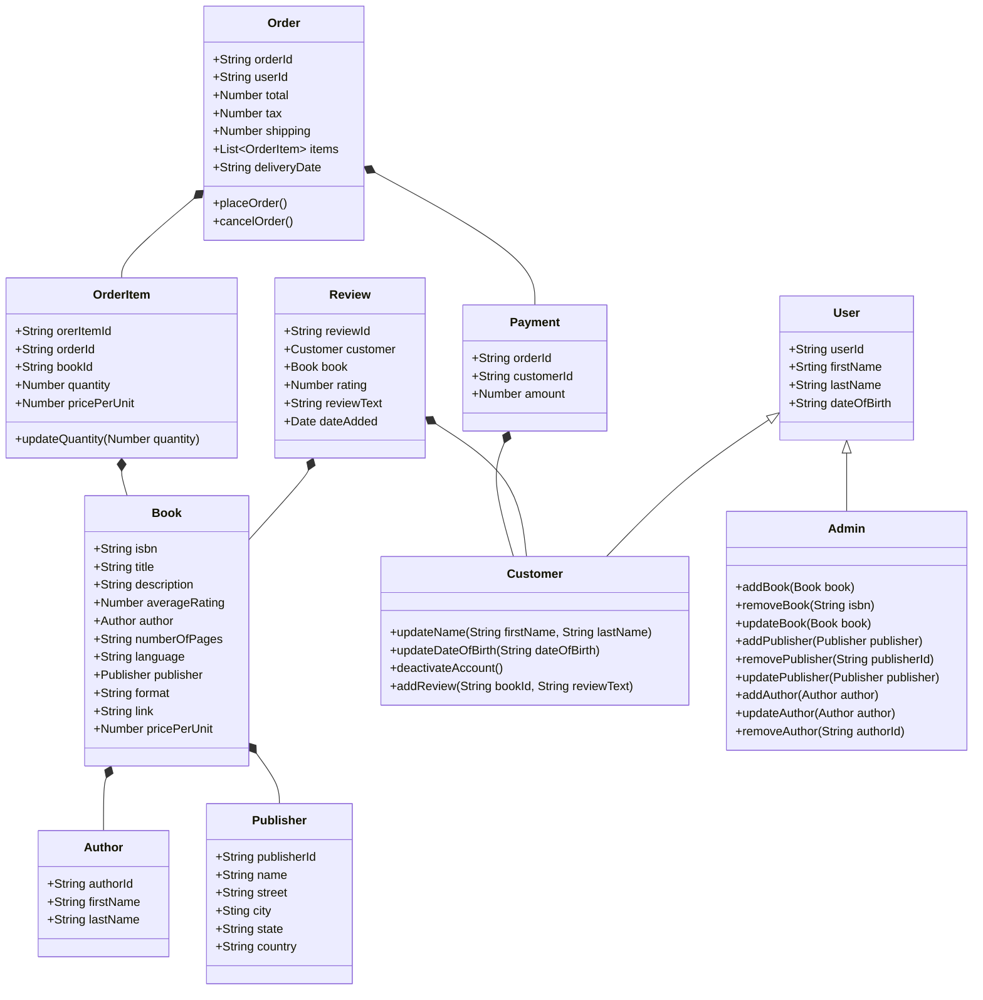

# Domain Model

```mermaid
classDiagram

    class Order{
        +String orderId
        +String userId
        +Number total
        +Number tax
        +Number shipping
        +List~OrderItem~ items
        +String deliveryDate

        +placeOrder()
        +cancelOrder()
    }

    class OrderItem{
        +String orerItemId
        +String orderId
        +String bookId
        +Number quantity
        +Number pricePerUnit

        +updateQuantity(Number quantity)
    }

    class Book{
        +String isbn
        +String title
        +String description
        +Number averageRating
        +Author author
        +String numberOfPages
        +String language
        +Publisher publisher
        +String format
        +String link
        +Number pricePerUnit
    }
    class Review{
        +String reviewId
        +Customer customer
        +Book book
        +Number rating
        +String reviewText
        +Date dateAdded
    }

    class Author{
        +String authorId
        +String firstName 
        +String lastName
    }

    class Publisher{
        +String publisherId
        +String name
        +String street
        +Sting city
        +String state
        +String country
    }

    class User{
        +String userId
        +Srting firstName
        +String lastName
        +String dateOfBirth

    }

    class Customer{
        +updateName(String firstName, String lastName)
        +updateDateOfBirth(String dateOfBirth)
        +deactivateAccount()
        +addReview(String bookId, String reviewText)
    }

    class Admin{

        +addBook(Book book)
        +removeBook(String isbn)
        +updateBook(Book book)
        +addPublisher(Publisher publisher)
        +removePublisher(String publisherId)
        +updatePublisher(Publisher publisher)
        +addAuthor(Author author)
        +updateAuthor(Author author)
        +removeAuthor(String authorId)
    }

    class Payment{
        +String orderId
        +String customerId
        +Number amount
    }

    Order *-- OrderItem
    Order *-- Payment
    Payment *-- Customer
    OrderItem *-- Book
    Book *-- Author
    Book *-- Publisher
    Review *-- Customer
    Review *-- Book

    %% Inheritance
    User <|-- Customer
    User <|-- Admin
```